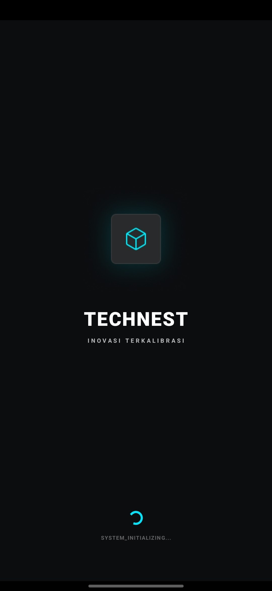
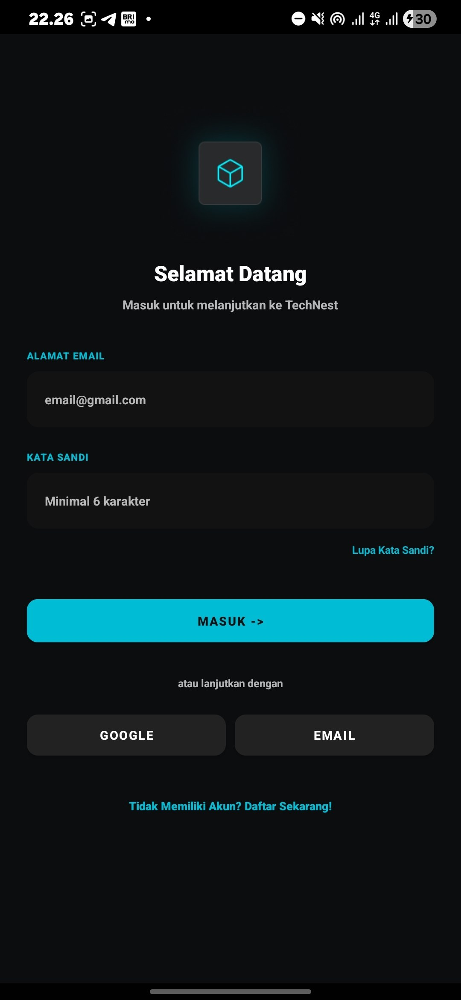
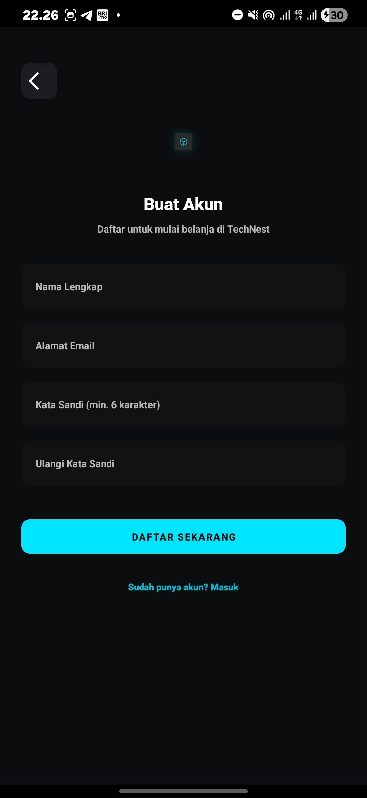
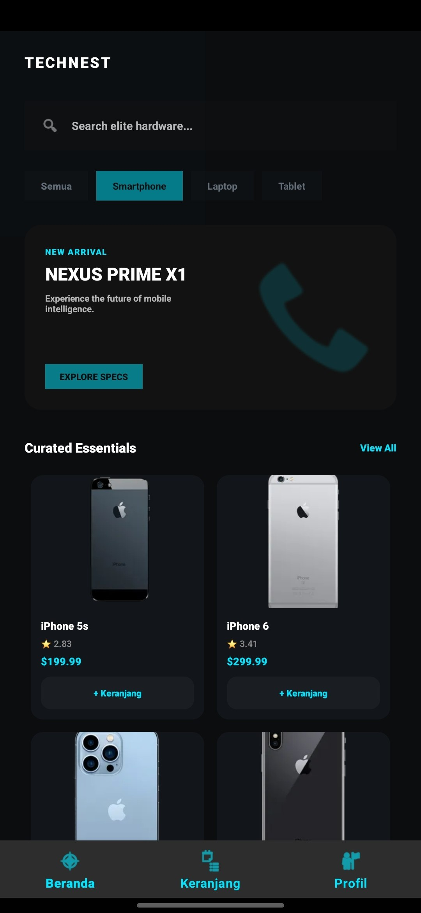
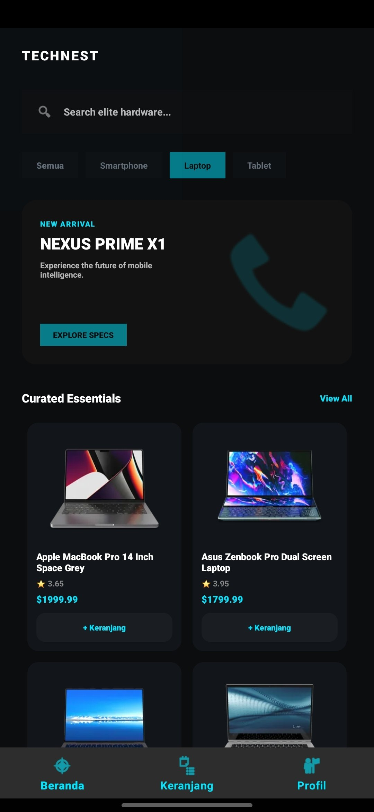
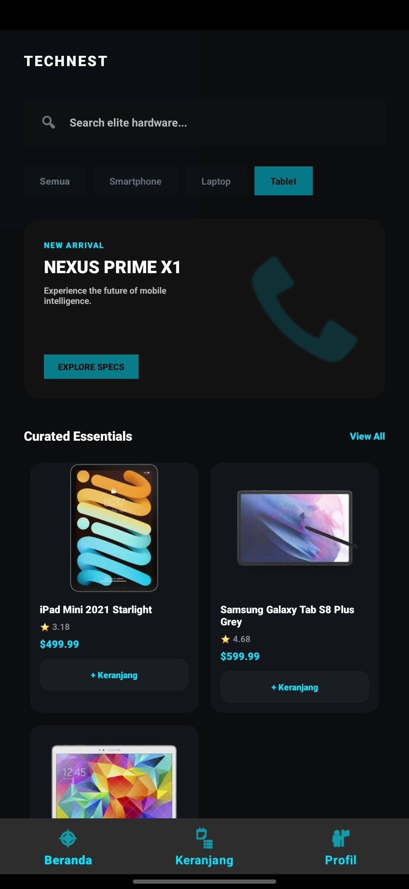
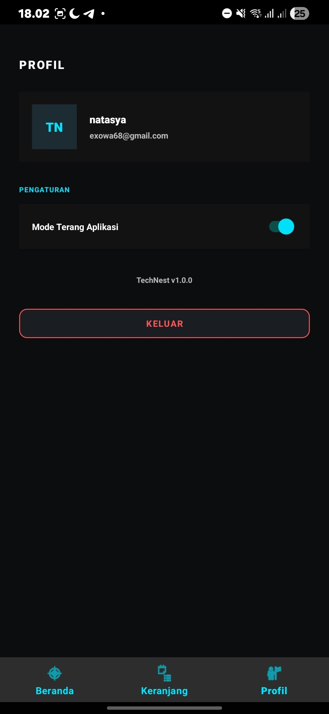

<p align="center">
  
</p>

# 📱 TechNest - E-Commerce & Gadget Catalog

[](https://developer.android.com)
[](https://www.oracle.com/java/)
[](#)

**TechNest** adalah aplikasi Android berbasis e-commerce dan katalog gawai (*gadget*) modern yang dirancang khusus untuk memenuhi kriteria Tugas Final Lab Mobile 2026. Aplikasi ini mendukung pengalaman belanja yang mulus baik dalam kondisi online maupun offline menggunakan arsitektur caching lokal yang cerdas.

---

## 📸 Tampilan Aplikasi (Screenshots)

### 1. Alur Autentikasi & Antarmuka Awal
| Splash Screen | Halaman Login | Halaman Register |
| :---: | :---: | :---: |
|  |  |  |

### 2. Katalog Produk (Grid View) & Mode Cache Offline
| Kategori Smartphone | Kategori Laptop | Kategori Tablet | Mode Offline |
| :---: | :---: | :---: | :---: |
|  |  |  |  |

### 3. Fitur Transaksi & Pengaturan Pengguna
| Keranjang Belanja (My Cart) | Halaman Profil & Tema |
| :---: | :---: |
|  |  |
---

## 🚀 Fitur Utama & Spesifikasi Teknis

Aplikasi ini diimplementasikan dengan memenuhi seluruh spesifikasi teknis yang diwajibkan:

* **Dual-Activity Architecture:** Menggunakan struktur `MainActivity` sebagai gerbang utama/launcher aplikasi dan `DetailActivity` untuk informasi produk mendalam.
* **Explicit Component Messaging (Intent):** Berpindah antar-halaman secara responsif sambil membawa data produk secara aman.
* **Optimized Grid Layout (RecyclerView):** Menampilkan katalog gawai dalam bentuk grid 2 kolom yang rapi dan interaktif.
* **Dynamic Fragment Navigation:** Manajemen perpindahan tab menggunakan *Navigation Component* (Jetpack) demi navigasi yang efisien.
* **Asynchronous Processing (Background Thread):** Pemrosesan data jaringan berjalan di latar belakang menggunakan Executor/Handler sehingga UI tetap lancar.
* **RESTful API Integration (Networking):** Mengonsumsi data produk teknologi secara real-time dari API DummyJSON menggunakan library **Retrofit**.
* **Smart Offline Caching & Persistence (SQLite):** * **Fitur Keranjang:** Menyimpan item belanja lokal lewat `CartDatabaseHelper`.
    * **Cache Offline:** Jika koneksi internet terputus, aplikasi otomatis menyaring dan menampilkan data produk terakhir yang tersimpan berdasarkan kategori aktif.
* **Dynamic Theme Toggle (SharedPreferences):** Mendukung fitur ganti tema (Dark Theme / Light Theme) secara instan melalui halaman profil, di mana pilihan user akan tersimpan permanen meskipun aplikasi ditutup.

---

## ✨ Fitur Kreativitas & Inovasi Tambahan (+10% Poin)

Selain memenuhi spesifikasi standar lab, TechNest juga dilengkapi dengan fitur tambahan yang meningkatkan nilai guna (*User Experience*):
* **Dynamic Checkbox Checkout Selection:** Pengguna dapat memilih secara spesifik (*multi-select*) produk mana saja di dalam keranjang yang ingin diproses ke halaman pembayaran menggunakan integrasi status boolean dinamis pada SQLite.
* **Real-time Price Engine:** Total harga belanja di bagian bawah keranjang akan langsung bertambah atau berkurang secara *real-time* mengikuti aksi centang pengguna tanpa perlu memuat ulang (*refresh*) halaman fragment.

---

## 🛠️ Tech Stack & Libraries

* **Language:** Java
* **UI Architecture:** Material Design components, XML Layouts, RecyclerView (GridLayoutManager)
* **Networking:** Retrofit 2 & OkHttp
* **Database lokal:** SQLite (SQLiteOpenHelper)
* **Key-Value Storage:** SharedPreferences

---

## 📂 Struktur Project (Android View)

```text
app/
├── manifests/
│   └── AndroidManifest.xml      # Konfigurasi aplikasi, izin internet, & launcher Activity
│
├── java + kotlin/
│   └── com.example.technest/
│       ├── API/                 # Manajemen Retrofit & endpoint API (ApiService, ProductRepository)
│       ├── Adapter/             # Pengelola RecyclerView (ProductAdapter, CartAdapter)
│       ├── Database/            # Pengelola SQLite lokal (CartDatabaseHelper)
│       ├── Fragment/            # Halaman interface tab (HomeFragment, CartFragment, ProfileFragment)
│       ├── Model/               # POJO / Data Class untuk parsing JSON (Product, ProductResponse)
│       ├── CheckoutActivity     # Halaman proses checkout produk
│       ├── DetailActivity       # Halaman detail informasi produk mendalam
│       ├── LoginActivity        # Halaman autentikasi masuk user
│       ├── MainActivity         # Halaman utama penampung fragment navigasi
│       ├── RegisterActivity     # Halaman pendaftaran akun baru
│       └── SplashActivity       # Halaman pembuka (Splash Screen) awal aplikasi
│
├── res/ (Resources)
│   ├── drawable/                # Aset gambar, ikon, dan background custom (ic_technest_logo, dll.)
│   ├── layout/                  # File desain UI XML (activity_*.xml & fragment_*.xml)
│   ├── menu/                    # Desain menu untuk bottom navigation bar
│   └── values/
│       ├── colors.xml           # Definisi palet warna neon & dasar aplikasi
│       ├── strings.xml          # Penyimpanan teks statis aplikasi
│       └── themes/              # Konfigurasi gaya tema (themes.xml & themes.xml (night))
│
└── Gradle Scripts/              # Build configuration & dependensi library (Retrofit, Gson, dll.)

```
## 🚀 Cara Penggunaan & Alur Kerja Aplikasi

### 1. Mode Online (Koneksi Sempurna)
* 🌐 **Ambil Data Real-time:** Saat aplikasi dibuka dengan koneksi internet, aplikasi langsung mengambil data gawai (gadget) segar dari API DummyJSON.
* 💾 **Sinkronisasi Otomatis:** Data tersebut otomatis disalin langsung ke dalam tabel *cache* SQLite lokal agar data aplikasi selalu up-to-date.

### 2. Mode Offline (Tanpa Jaringan)
* ⚠️ **Pemberitahuan Gagal:** Jika koneksi internet terputus atau gagal, aplikasi akan memunculkan tombol *Refresh/Retry* atau pesan *Toast* pemberitahuan offline di layar.
* 🔍 **Pencarian SQLite:** Aplikasi akan beralih memuat data dari database SQLite lokal dan menyaring produk sesuai kategori tab yang kamu pilih secara presisi.

### 3. Manajemen Tema
* 👤 **Pengaturan Tampilan:** Buka tab Profil, lalu tekan tombol saklar (*Toggle Switch*) untuk mengubah mode tampilan.
* 🎨 **Perubahan Instan:** Aplikasi secara instan mengganti konfigurasi warna dasar (*Light/Dark Mode*) tanpa merusak status atau menghentikan alur kerja aplikasi.

---

## 👤 Developer
* **Nama:** Natasya
* **Proyek:** Tugas Final Lab Mobile 2026
* **Status Aplikasi:** 🚀 Stabil 
